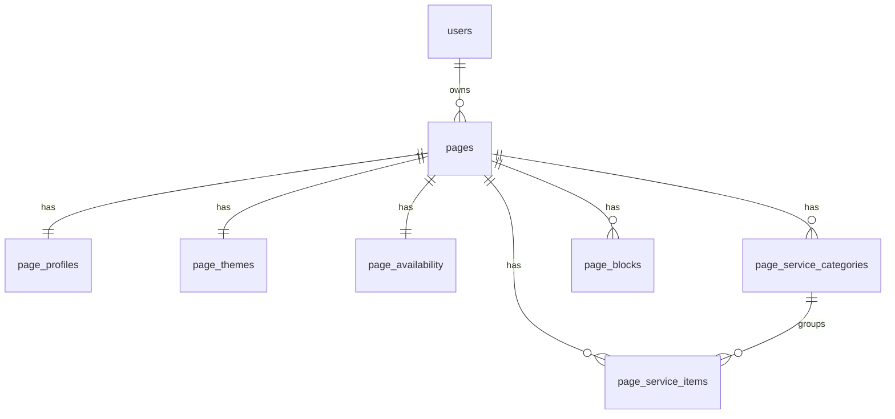

# Bookgo — модель данных (актуальная)

## Фаза 1 — auth (готово)

- `users` — аккаунт админки

## Фаза 2 — pages (текущая)

### `pages`

Мета booking-страницы: `slug`, `published`, `published_at`, `is_default`, `settings_version`, `services_use_categories`, `section_layout` (JSONB).

### `page_profiles` (1:1)

Публичный профиль витрины — поля из `ProfileSettings`.

### `page_themes` (1:1)

`preset`, `accent_color`, `mode`.

### `page_availability` (1:1)

Глобальные настройки расписания + `days` JSONB (`DaySchedule[]` без label/letter в БД).

### `page_service_categories` / `page_service_items`

Каталог услуг. `price_amount` в минорных единицах (копейки/центы).

### `page_blocks`

Опциональный контент: stories, gallery, video, location, contacts, reviews, faq, cancellationPolicy, customQuestions. UNIQUE `(page_id, type)`.

---

## Сборка API

Бэкенд: `assemblePageSettings()` читает все таблицы и возвращает один объект `PageSettings` для фронта.

`PATCH /pages/:id` → `disassemblePagePatch()` раскладывает partial settings по таблицам в транзакции.

---

## Фаза 3 — bookings (позже)

- `bookings` — `page_id`, `page_service_item_id`, `starts_at`, …
- `booking_answers` — ответы на `customQuestions`

---

## Фаза 4 — multi-staff (позже)

- `page_staff` — специалисты на странице
- `page_staff_service` — M:N услуга ↔ человек
- `page_availability` → per `staff_id`

Миграция solo: одна строка `page_staff` из `page_profiles`.

---

## Миграции

| Файл | Таблицы |
|------|---------|
| 001 | `users` |
| 002 | `pages` |
| 003 | `page_profiles` |
| 004 | `page_themes` |
| 005 | `page_service_categories`, `page_service_items` |
| 006 | `page_availability` |
| 007 | `page_blocks` |

Workspaces, `page_views` — отложены.
